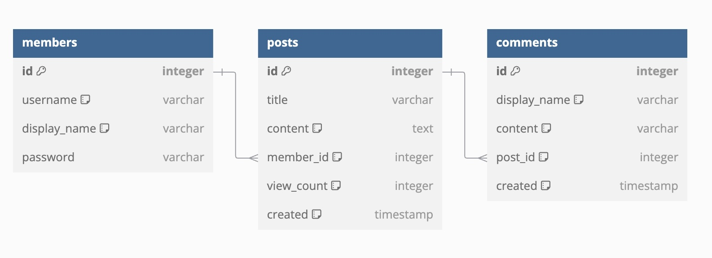

# Board

## 프로젝트 개요
스프링을 처음 공부하며 게시판을 구현해보았습니다. 사용자는 회원가입 및 로그인 후 게시글을 작성하고, 댓글을 남길 수 있습니다. 게시글은 수정 및 삭제가 가능합니다.
처음엔 게시판을 완성하는데 집중하여 구현 후 RESTful API 설계를 적용해보았습니다. 계속해서 기능 추가/개선, 새로운 기술 스택 적용등을 통해 업데이트 예정입니다.

## 주요 기능
- **게시글 CRUD**
    - 게시글 작성, 조회, 수정, 삭제
    - 게시글 작성자만 수정 및 삭제 가능 (Spring Security 활용)
    - 조회수 중복 증가 방지 (Redis 30초 TTL)

- **회원 관리**
    - 회원가입 및 로그인

- **댓글 기능**
    - 댓글 작성 및 조회

## 기술 스택

### 백엔드
- **Spring Boot**
- **JPA**
- **Spring Security**
- **AWS RDS (MySQL)**
- **Redis**

### 프론트엔드
- **HTML/CSS/JavaScript**

## 주요 패키지 설명
- `comment`: 댓글과 관련된 API 및 서비스
- `config`: Spring Security 설정
- `member`: 회원 가입 및 로그인 관련 클래스
- `post`: 게시글 CRUD 기능 관련 클래스

## REST API 명세서

### Post API
| 메소드 | 엔드포인트 | 설명 |
| --- | --- | --- |
| POST | `/api/post` | 새 게시물 생성 |
| GET | `/api/post/{id}` | ID로 게시물 조회 |
| PUT | `/api/post/{id}` | ID로 게시물 수정 |
| DELETE | `/api/post/{id}` | ID로 게시물 삭제 |

### Member API
| 메소드 | 엔드포인트 | 설명 |
| --- | --- | --- |
| POST | `/member` | 새 회원 추가 |

### Comment API
| 메소드 | 엔드포인트 | 설명 |
| --- | --- | --- |
| POST | `/api/comment` | 새 댓글 생성 |
| GET | `/api/comment/{postId}` | 특정 게시물의 댓글 조회 |

## 데이터베이스 구조

